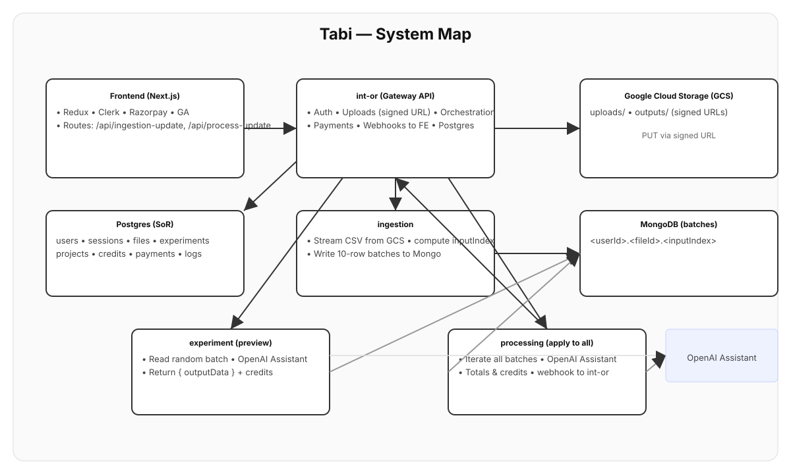

# Tabi — Create, enrich, and transform data at scale

**Tabi** turns a spreadsheet column into new content at scale.
Upload a CSV → pick a column → describe what you want in natural language → preview → apply to all → download a fresh CSV.
Auth, credits/payments, and exports are built in.

---

## 📹 Demo

<video src="docs/tabi-demo.mp4" controls width="100%"></video>

---

## 📂 What’s in this repo?

-   `/frontend` - The Next.js app (handles Clerk auth, Redux, Razorpay, GA, and the upload UI).
-   `/backend` - Contains all the microservices: `int-or` (gateway), `ingestion`, `experiment`, and `processing`.
-   `/docs` - Diagrams and assets (e.g., `architecture.svg`, demo video/gif).

The **frontend talks only to `int-or`** (the gateway). `int-or` coordinates:
-   Signed URLs to upload CSVs to **GCS**.
-   **Ingestion** (finds the target column, batches rows into Mongo).
-   **Experiment** (generates a 10-row preview via your OpenAI Assistant).
-   **Processing** (applies the prompt to all batches).
-   Export path generation and signed download URLs.
-   Payments (Razorpay) and user credits.
-   Clerk webhooks for user/session bookkeeping.

---

## 🤔 How Tabi works (non‑technical)

1.  **Upload** — The browser gets a signed URL and uploads your CSV directly to Google Cloud Storage.
2.  **Pick a column** — Choose the column the model should read from (e.g., “description”).
3.  **Preview** — Tabi runs your prompt on ~10 rows so you can inspect the output and tweak your instructions.
4.  **Apply to all** — Tabi processes every row in the file; credits/tokens are tracked.
5.  **Download** — You get a secure, signed link to download the resulting CSV.

---

## 🗺️ System Map




---

## 🚀 Quick Start (Local)

> Want to get everything running with one command? Use **Docker** below. Otherwise, follow the manual steps to run the backend and frontend separately.

### Option A — Run with Docker (Recommended)

From the repository root:

```bash
docker compose up --build
````

Services will be available at:

  - **int-or**: `http://localhost:3000`
  - **ingestion**: `http://localhost:5001`
  - **experiment**: `http://localhost:5002`
  - **processing**: `http://localhost:5003`
  - **frontend**: `http://localhost:3001`

### Option B — Run Manually

#### 1\. Backend

Follow each service's README for environment keys and specific setup steps:

  - `backend/int-or/README.md`
  - `backend/ingestion/README.md`
  - `backend/experiment/README.md`
  - `backend/processing/README.md`

**Tip:** In `int-or`, set the `FRONTEND_WEBHOOK_URL` to your frontend's base URL (e.g., `http://localhost:3001`) so that callbacks for `/api/ingestion-update` and `/api/process-update` reach the UI.

#### 2\. Frontend (Next.js)

```bash
cd frontend
cp .env.example .env.local
```

Now, fill in the required values in your new `.env.local` file:

```env
# The base URL for the int-or gateway service
NEXT_PUBLIC_API_URL=http://localhost:3000

# Your Clerk credentials
NEXT_PUBLIC_CLERK_PUBLISHABLE_KEY=...
CLERK_SECRET_KEY=...

# Optional keys
NEXT_PUBLIC_RAZORPAY_KEY=...        # For enabling payments
NEXT_PUBLIC_GA_ID=...               # For Google Analytics 4
```

Finally, install dependencies and start the development server:

```bash
pnpm i
pnpm dev
```

The UI will be running at `http://localhost:3001`.

-----

## ⚙️ Deep Dive (For Engineers)

All frontend calls hit the `int-or` gateway:

1.  `POST /api/intor/upload-to-GCP` → `int-or` returns a signed URL. The browser then `PUT`s the CSV directly to `gs://<bucket>/uploads/<userId>.<fileId>`.
2.  `POST /api/intor/start-ingestion` → `ingestion` service streams the CSV from GCS and writes 10-row batch documents to MongoDB collections named `<userId>.<fileId>.<inputIndex>`.
3.  `POST /api/intor/start-experiment` → `experiment` service picks a random batch, sends `{ expPrompt, inputData[] }` to the OpenAI Assistant, and returns `{ outputData[] }` along with token usage and credit cost.
4.  `POST /api/intor/start-processing` → `processing` service iterates through every batch, calls the Assistant, writes the `outputData[]` back to MongoDB, tallies tokens/cost, and then sends a webhook to `int-or`.
5.  `int-or` asks the `ingestion` service for the output path (`/api/ing/output-path`), writes the final file to `gs://<bucket>/outputs/<userId>.<fileId>-output.csv`, and returns a signed download URL to the frontend.
6.  `int-or` updates its Postgres database and webhooks the frontend to update the UI state:
      - `POST /api/ingestion-update`
      - `POST /api/process-update`

<!-- end list -->

  - **Payments**: The frontend opens Razorpay Checkout, which hits `int-or` to create and verify the order. User credits are then updated in the SQL database.
  - **Auth**: `int-or` consumes webhooks from Clerk to keep its user and session state in sync.

*For exact request/response bodies, see the service READMEs in the `/backend` directory.*

-----

## ☁️ Deploying

  - **Local Development**: `docker compose up --build`
  - **Cloud**: Deploy each backend service and the frontend app to your preferred platform (e.g., Google Cloud Run, Vercel, AWS).

Production environment keys, URLs, and webhook details are specified in each project's README:

  - `backend/int-or/README.md`
  - `backend/ingestion/README.md`
  - `backend/experiment/README.md`
  - `backend/processing/README.md`
  - `frontend/README.md`

-----

## ✅ Alignment Checklist

Ensure these are configured correctly for everything to work seamlessly:

  - **OpenAI Assistant** is prompted to return **only JSON** (either a raw array or an object like `{ "outputData": [...] }`).
  - **GCS paths** follow this convention:
      - Uploads → `uploads/<userId>.<fileId>`
      - Exports → `outputs/<userId>.<fileId>-output.csv`
  - **Mongo collections** are named `<userId>.<fileId>.<inputIndex>`.
  - **`int-or`'s `FRONTEND_WEBHOOK_URL`** is reachable, and the corresponding frontend API routes exist:
      - `POST /api/ingestion-update`
      - `POST /api/process-update`
  - **GCS CORS** and **Application Default Credentials (ADC)** are set up so the browser can `PUT` files and backend services can stream them.

-----

## 🔧 Troubleshooting

  - **CSV upload 403 error**: Check GCS CORS settings or ADC permissions. The signed URL may have also expired.
  - **Empty preview**: The ingestion process may not be finished, or there could be a database/collection name mismatch.
  - **JSON parse errors**: Tighten the Assistant prompt to "Return only valid JSON."
  - **No frontend updates**: The `FRONTEND_WEBHOOK_URL` is likely incorrect, or the webhook handler routes are missing/broken.
  - **Credits not updating**: Verify the Razorpay webhook flow and the final SQL update logic in `int-or`.

-----

## 💡 Contribute — Fun Challenge 🎯

We love creative PRs\!

  - Solve a real market pain on top of Tabi (e.g., smart templates, a de-duplication/matching tool).
  - Build an agentic pipeline that plans the ingestion/preview/processing steps and can self-heal from JSON errors.

Send us demo video (≤3 minutes) at [connect@columsprout.ai](mailto:connect@columsprout.ai). If it clearly moves the needle, we’d love to chat.

-----

## 📄 License

**MIT** — see the `LICENSE` file for details.